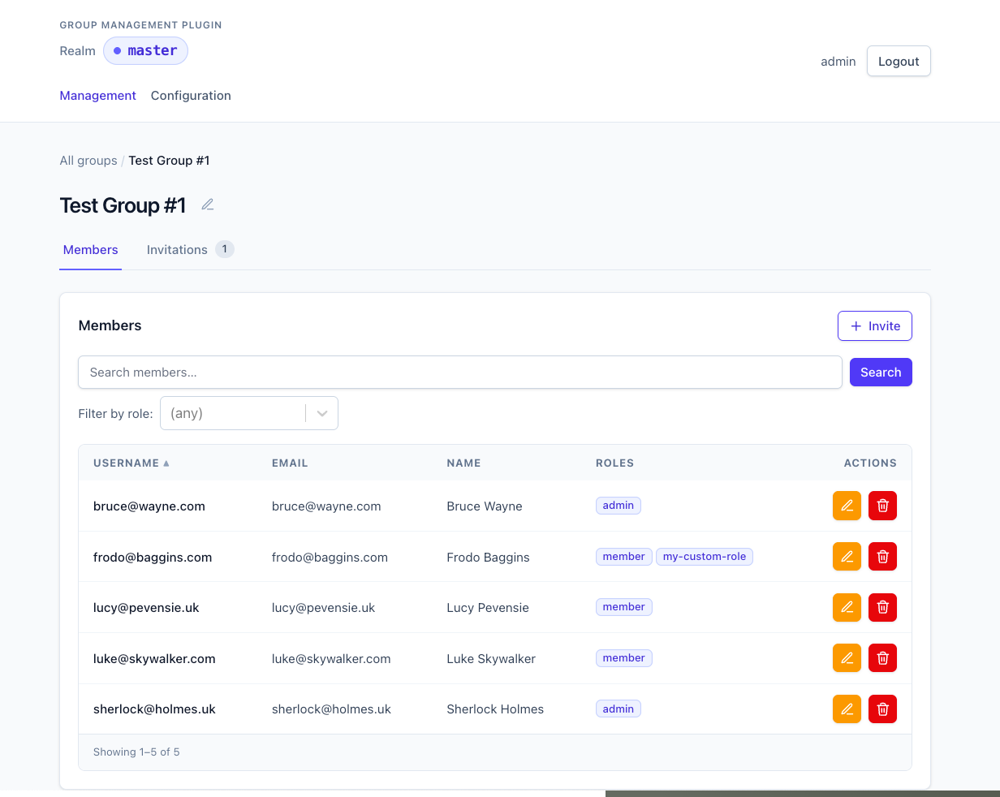
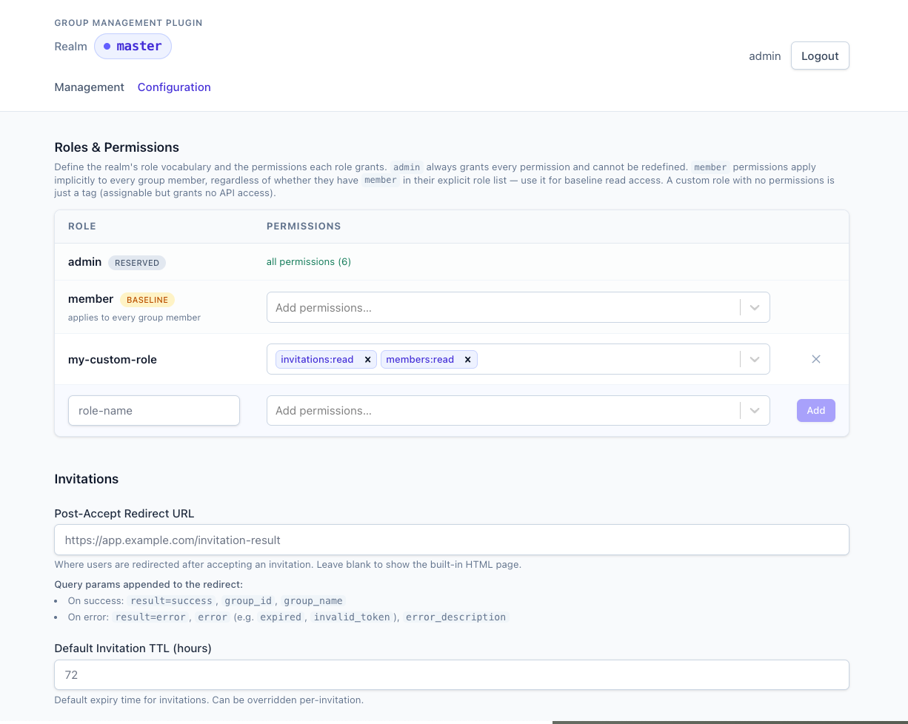

# Keycloak Group Management Plugin

A Keycloak SPI plugin that adds local group administration, invitation management, and membership controls via a REST API — plus an optional bundled admin UI for realm operators.

- [Features](#features)
- [Documentation](#documentation)
- [Bundled admin UI](#bundled-admin-ui)
  - [Group dashboard](#group-dashboard)
  - [Realm configuration](#realm-configuration)
- [Installation & Setup](#installation--setup)
  - [Post-install configuration](#post-install-configuration)
- [Local development environment](#local-development-environment)

## Features

- **Custom Roles** — Build custom membership roles per realm and assign them to users.
- **Invitations** — Built in and customizeable email invitations.
- **API Driven** — Built in REST API for managing, listing, filtering all aspects of membership.
- **Built in Admin** — Built in [configuration and membership admin interface](#bundled-admin-ui) for realm admins.
- **JWT Token Mapper** — Easily add group membership roles to user JWTs.
- **Per-Realm Configuration** — Invitation TTL, post-accept URL, role vocabulary, and permissions on each realm.

## Documentation

- [docs/api.md](docs/api.md)
- [docs/authorization.md](docs/authorization.md)
- [docs/configuration.md](docs/configuration.md)
- [docs/development.md](docs/development.md)
- [docs/deployment.md](docs/deployment.md)

## Bundled admin UI

The plugin by default includes an optional membership admin UI served by Keycloak at `/realms/{realm}/group-mgmt/admin/`. Realm and group admins share the same per-group dashboard; the Configuration tab is shown only to realm admins.

### Group dashboard



Invite, role-edit, and remove members inline. Members support search and role filtering; the Invitations tab carries a pending-count badge.

### Realm configuration



Realm admins manage the role vocabulary, per-role permissions, post-accept redirect URL, and invitation TTL from the browser — no admin-console attribute editing required. See [docs/configuration.md](docs/configuration.md) for the underlying realm attributes and the REST equivalent.

## Installation & Setup

We publish a built JAR (with the bundled admin UI included) for every tagged release of this repo. Download it and drop it into your Keycloak's `providers/` directory.

```bash
export VERSION=1.0.0
wget "https://github.com/5-stones/keycloak-group-management/releases/download/v$VERSION/keycloak-group-management-$VERSION.jar"
```

In a `Dockerfile`:

```Dockerfile
ENV GROUP_MGMT_VERSION=1.0.0
ADD --chown=keycloak:keycloak \
  "https://github.com/5-stones/keycloak-group-management/releases/download/v$GROUP_MGMT_VERSION/keycloak-group-management-$GROUP_MGMT_VERSION.jar" \
  /opt/keycloak/providers/
```

> **Note:** `ADD` is used because modern `quay.io/keycloak/keycloak` base images [don't ship a package manager](https://www.keycloak.org/server/containers#_installing_additional_rpm_packages).

After placing the JAR, restart Keycloak. For production-mode (optimized) installs, run `kc.sh build` first so Quarkus picks up the new provider. On first start, the plugin auto-creates the `group_invitation` and `group_member_role` tables via Liquibase — no external migration step needed.

### Post-install configuration

Append `/realms/{realm}/group-mgmt/*` to the realm's existing **`security-admin-console`** client — both **Valid Redirect URIs** and **Web Origins**. That single edit covers both the bundled admin SPA and the default invitation accept flow.

If you ship a customer-facing UI with its own OIDC client (different theme, IdPs, etc.), point invitations at it via the admin UI's **Invitation Login Client ID** setting (or the `group-mgmt-invitation-client-id` realm attribute). See [docs/deployment.md](docs/deployment.md) for the customer-facing-client setup.

After that, realm admins manage everything else from the bundled admin UI at `/realms/{realm}/group-mgmt/admin/`.

Add the **Group Management Role** OIDC mapper to the client scope used by your application clients to surface the `group_roles` claim in tokens (see [docs/api.md](docs/api.md#jwt-token-mapper)).

## Local development environment

`docker compose up` boots the full stack — Keycloak, Postgres, Mailpit, and the admin SPA dev server — wired up against a pre-imported `master` realm with the dev OIDC client ready to go.

```bash
./gradlew bundleAdminUi build && docker compose up   # full stack incl. bundled admin UI
./gradlew build && docker compose up                 # backend only (no Node.js needed)
```

| Service | URL | What it is |
|---|---|---|
| **Keycloak** | <http://localhost:8080> · login `admin` / `admin` | The plugin host. |
| **Bundled admin UI** | <http://localhost:8080/realms/master/group-mgmt/admin/> | The shipped admin UI served from inside the plugin JAR (only after `bundleAdminUi`). |
| **Admin SPA (dev)** | <http://localhost:3000> | Hot-reloading Vite dev server for `admin/`. Same code as the bundled UI. |
| **Mailpit** | <http://localhost:8025> | Captures every invitation email the plugin sends. |
| **PostgreSQL** | `localhost:5432` · creds `keycloak` / `keycloak` | Plugin tables (`group_invitation`, `group_member_role`) live here alongside Keycloak's own. |

Tests run in-process against an H2 in-memory database (JUnit 5 + Hibernate); no Docker needed. For the full developer workflow — hot-reload, restart-on-rebuild, test commands, the SPA bundling pipeline — see [docs/development.md](docs/development.md).
