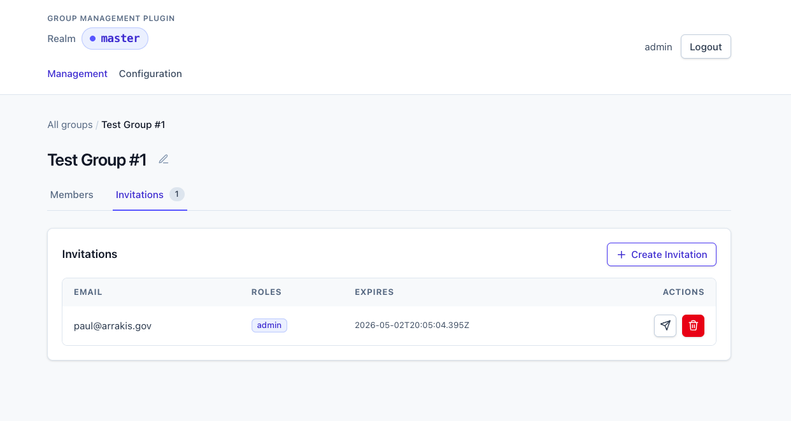
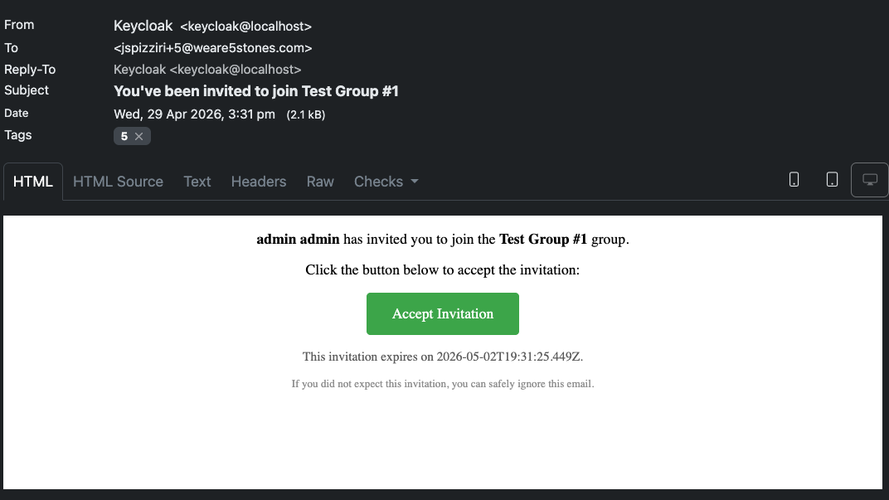

# REST API

Base path for JSON APIs: `/realms/{realm}/group-mgmt/api`

Top-level user-facing endpoints (outside `/api`):

- `/realms/{realm}/group-mgmt/invitations/accept?token=...` — invitation landing page (HTML or JSON depending on method). Kept stable so URLs in already-sent invitation emails don't break.
- `/realms/{realm}/group-mgmt/config/...` — bundled admin SPA (only present when the JAR is built with `bundleAdminUi`; see [Development](development.md#bundling-the-admin-ui-into-the-jar)).

All `/api/*` paths require a Bearer token. Permissions are documented per endpoint and explained in detail in [Authorization](authorization.md).

## Invitations

| Method | Path | Description |
|--------|------|-------------|
| `POST` | `/groups/{groupId}/invitations` | Create invitation. Body: `{ "email": "...", "roles": ["admin", "billing"], "ttlHours": 72 }`. `roles` defaults to `[]` (plain member). |
| `GET` | `/groups/{groupId}/invitations` | List invitations. Params: `page`, `pageSize` |
| `GET` | `/groups/{groupId}/invitations/{id}` | Get invitation |
| `DELETE` | `/groups/{groupId}/invitations/{id}` | Delete/revoke invitation |
| `POST` | `/groups/{groupId}/invitations/{id}/resend` | Resend invitation email |

Pending invitations as shown in the bundled UI:



Creating an invitation triggers a templated email — see [Configuration → Customizing the invitation email](configuration.md#customizing-the-invitation-email) for the message keys and how to override them via a custom Keycloak email theme. In the dev environment, the email lands in Mailpit at <http://localhost:8025>:



## Group

| Method | Path | Description |
|--------|------|-------------|
| `GET` | `/groups/{groupId}` | Read basic group info. Response: `{id, name, path}`. Requires the caller to be a member of the group (or a realm admin). |
| `PUT` | `/groups/{groupId}` | Rename the group. Body: `{ "name": "new-name" }`. Requires `group:write`. Rejects names that collide with a sibling. |

## Members

| Method | Path | Description |
|--------|------|-------------|
| `GET` | `/groups/{groupId}/members` | List members. Params: `page`, `pageSize`, `search`, `sortBy`, `sortDir`, `role` |
| `DELETE` | `/groups/{groupId}/members/{userId}` | Remove member (also removes their roles) |
| `PUT` | `/groups/{groupId}/members/{userId}/roles` | Set the member's roles. Body: `{ "roles": ["admin", "billing"] }`. Bulk replace (idempotent). |

## Invitation Acceptance

> **Outside `/api`** — these paths sit at `/realms/{realm}/group-mgmt/invitations/accept`, not under the JSON-API base. URLs in already-sent invitation emails reference this stable path; do not change it.

| Method | Path | Description |
|--------|------|-------------|
| `GET` | `/invitations/accept?token=...` | Browser flow: login/register then accept |
| `POST` | `/invitations/accept?token=...` | API flow: accepts with bearer token |

## User

| Method | Path | Description |
|--------|------|-------------|
| `GET` | `/me/groups` | List groups for the authenticated user. Params: `page`, `pageSize`, `search`, `sortBy`, `sortDir` |

## Roles

| Method | Path | Description |
|--------|------|-------------|
| `GET` | `/roles` | List the realm's role vocabulary, the permission vocabulary, and the configured role-to-permission map. Response: `{ "roles": ["admin", ...], "permissions": ["invitations:read", ...], "rolePermissions": { "viewer": ["members:read", ...] } }`. `roles` always includes `admin` and `member` (implicit). Use this to populate role pickers in your UI. |

## Configuration

| Method | Path | Description |
|--------|------|-------------|
| `GET` | `/config` | Get realm plugin configuration (realm admin only) |
| `PUT` | `/config` | Update realm plugin configuration (realm admin only) |

The realm-attribute keys returned and accepted are documented in [Configuration](configuration.md).

## Query Parameters

**Pagination** (all list endpoints):

| Param | Description | Default |
|-------|-------------|---------|
| `page` | Page number (1-based) | `1` |
| `pageSize` | Items per page (1-100) | `20` |

**Members endpoint** (`/groups/{groupId}/members`):

| Param | Description | Default |
|-------|-------------|---------|
| `search` | Partial match on username, email, first name, last name | _(none)_ |
| `sortBy` | Sort field: `username`, `email`, `name` | `username` |
| `sortDir` | Sort direction: `asc`, `desc` | `asc` |
| `role` | Return only members holding this role (e.g. `admin`) | _(none)_ |

**Groups endpoint** (`/me/groups`):

| Param | Description | Default |
|-------|-------------|---------|
| `search` | Partial match on group name | _(none)_ |
| `sortBy` | Sort field: `name` | `name` |
| `sortDir` | Sort direction: `asc`, `desc` | `asc` |

## JWT Token Mapper

The plugin registers a **Group Management Role** OIDC protocol mapper. Once added to a client scope, it emits a claim like:

```json
{
  "group_roles": [
    { "id": "50b9d34a-...", "roles": ["admin", "billing"], "name": "Engineering" },
    { "id": "a1b2c3d4-...", "roles": [], "name": "Marketing" }
  ]
}
```

`roles` is an array of strings — empty when the user is a plain member of the group with no explicit roles. Realm admins do not synthesize role values here; consumers that need to distinguish realm-admin status should use a separate claim.

**Configuration** (in Keycloak admin: Client Scopes → Mappers → Add mapper → By configuration → Group Management Role):

| Option | Description | Default |
|--------|-------------|---------|
| Token Claim Name | The claim key in the token | `group_roles` |
| Include Group Name | Include group name in each entry | `true` |
| Include in ID Token | Add claim to ID token | `true` |
| Include in Access Token | Add claim to access token | `true` |
| Include in Userinfo | Add claim to userinfo response | `true` |
