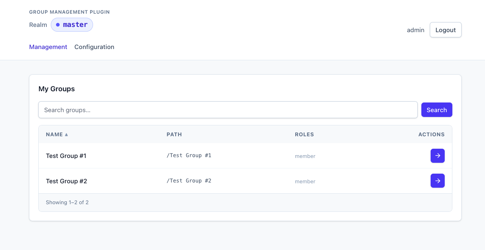
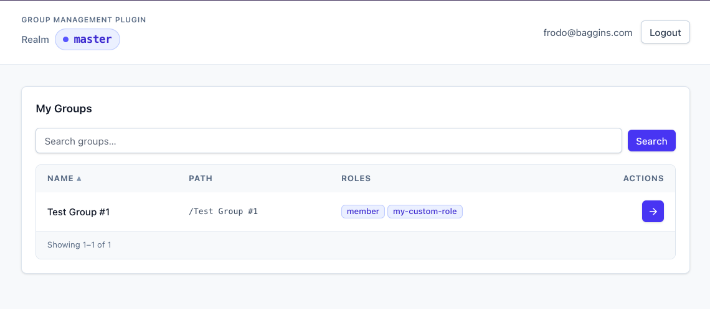
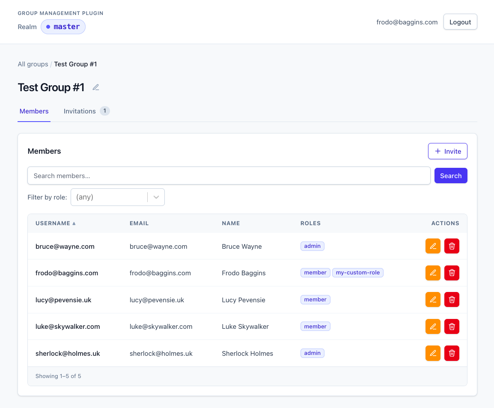
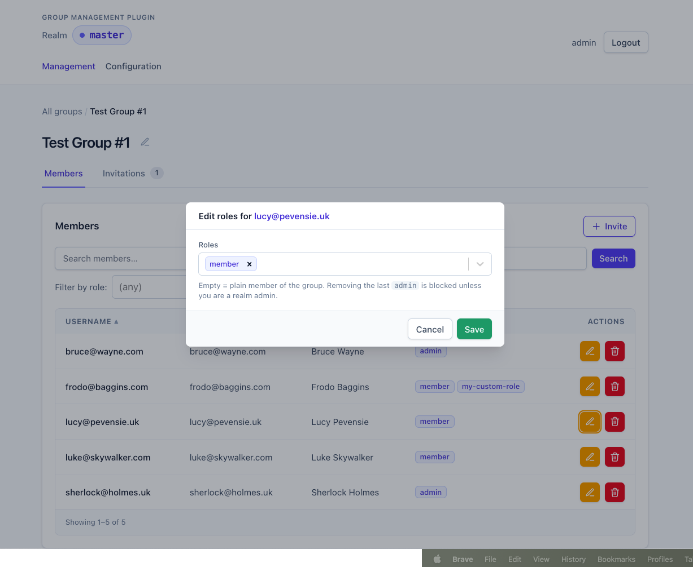

# Authorization

The plugin authorizes every REST call against a per-(realm, group, user) role assignment plus a realm-level role-to-permission map. This document describes that model end to end.

## Subjects

| Subject | Scope |
|---------|-------|
| **Realm admin** (`admin` role or `manage-users` on `realm-management`/`{realm}-realm` client) | All operations across all groups; bypasses last-admin guard |
| **Group admin** (member with the `admin` role in the group's `fs_group_member_role` table) | Implicitly grants every permission below |
| **Group member with permission roles** | Specific REST operations gated by individual permissions (see [Permissions](#permissions)) |
| **Authenticated user** | Accept invitations sent to their email, list their own groups |

A realm admin sees every group in the realm and the **Configuration** nav:



A group admin sees only the groups they belong to and the Configuration nav is hidden (it would write realm attributes):



Within a group, both subjects see the same dashboard — the per-row action icons are individually permission-gated:



## Role vocabulary

The role vocabulary for a given realm is `admin` + `member` + whatever is listed in the `group-mgmt-allowed-roles` realm attribute (comma-separated, e.g. `billing,lead,viewer`). `admin` and `member` are always implicit and cannot be removed. Role assignments outside the vocabulary are rejected with 400.

Role names are validated against `^[a-z0-9_-]{1,64}$`. A member can hold up to 32 distinct roles. The `admin` role is reserved for the privileged-management semantics; all other strings are application-defined and stored without interpretation.

The current vocabulary is queryable via `GET /api/roles` (see [API](api.md#roles)).

## Permissions

Beyond `admin`, finer-grained access is granted by mapping roles to a fixed permission vocabulary via the `group-mgmt-role-permissions` realm attribute (JSON; see [Configuration](configuration.md)). Each REST endpoint requires a specific permission; a user satisfies the check if they (a) are a realm admin, (b) hold the group's `admin` role, or (c) hold a role whose permission list includes the required permission.

| Permission | What it grants |
|------------|----------------|
| `group:write` | `PUT /api/groups/{id}` (rename the group) |
| `members:read` | `GET /api/groups/{id}/members` (incl. `?role=` filter) |
| `members:write` | `DELETE /api/groups/{id}/members/{userId}` |
| `roles:write` | `PUT /api/groups/{id}/members/{userId}/roles` |
| `invitations:read` | `GET /api/groups/{id}/invitations`, `GET /api/groups/{id}/invitations/{id}` |
| `invitations:write` | `POST /api/groups/{id}/invitations`, `DELETE /api/groups/{id}/invitations/{id}`, `POST /api/groups/{id}/invitations/{id}/resend` |

Example `group-mgmt-role-permissions` value:

```json
{
  "viewer": ["members:read", "invitations:read"],
  "manager": ["members:read", "members:write", "roles:write", "invitations:read", "invitations:write"],
  "billing": ["members:read"]
}
```

`viewer`, `manager`, and `billing` must also appear in `group-mgmt-allowed-roles` to be assignable. Roles defined in `group-mgmt-allowed-roles` but absent from `group-mgmt-role-permissions` are valid as plain tags (assignable, but grant no special access).

### The `member` role is special

Permissions configured for `member` apply **implicitly to every group member**, regardless of whether `member` appears in their explicit role list. Use it to grant baseline access — e.g. `{"member": ["members:read"]}` lets every member of the group see the roster without operators having to assign `member` to each user individually.

Setting member roles is done via the bundled UI (or `PUT /members/{id}/roles`); the editor is a multi-select bound to the realm's role vocabulary:



## Privilege-escalation guard

`roles:write` does not let a non-admin grant roles that exceed their own access. When setting member roles or creating an invitation, every role being **added** is checked: each of its permissions must be a subset of the actor's effective permissions. If not, the request returns 403 with a message naming the missing permissions. Removing roles is unaffected — you can remove any role from any member (subject to the last-admin guard).

The `admin` role requires an existing admin (group admin or realm admin) to grant. Realm admins and group admins bypass the guard entirely.

The check fires at invitation-creation time, not at accept time. The acceptor is being assigned roles the inviter already validated.

## Last-admin guard

Removing the last `admin` from a group is rejected with 409, regardless of how the removal is attempted (`setRoles` to a list without `admin`, `DELETE /members/{id}`, etc.). Realm admins bypass this guard so they can recover stranded groups.
